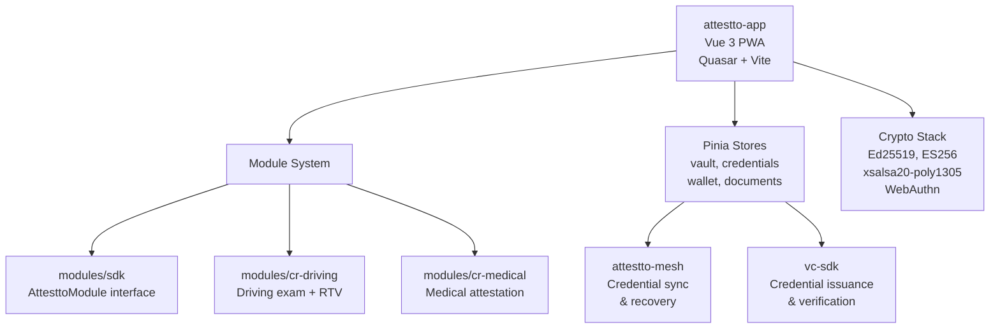

# attestto-app

> Sovereign citizen wallet — identity, credentials, documents, and country-specific modules in a mobile-first Progressive Web App.

Attestto App is a PWA that puts verifiable credentials, identity, document signing, and DID-authenticated payments in citizens' pockets. Built with Vue 3 and Quasar, installable from any browser, works offline, dark theme only. This is where citizens interact with their identity every day.

## Architecture



## Quick start

### Prerequisites

- Node.js 18+
- pnpm

### Install

```bash
pnpm install
pnpm dev      # Start dev server on http://localhost:5173
```

### Try it

1. Open http://localhost:5173
2. Create a vault with a passkey (WebAuthn)
3. Navigate to /wallet, /credentials, /documents
4. Install to home screen for PWA experience

Build for production:

```bash
pnpm build    # Creates dist/ for deployment
pnpm test     # Run 30 tests
pnpm typecheck
```

## Key concepts

### Core screens

| Route | Purpose | Auth required |
|-------|---------|---------------|
| `/lock` | Vault unlock via passkey / biometric | No |
| `/home` | Inbox — module items, notifications | Yes |
| `/wallet` | DID-authenticated payments | Yes |
| `/documents` | Signed documents, pending signatures | Yes |
| `/credentials` | VC vault (encrypted storage) | Yes |
| `/settings` | Language, security, backup | Yes |

All routes with `meta: { requiresAuth: true }` require vault unlock first.

### Crypto stack

| Operation | Method | Storage | Code |
|-----------|--------|---------|------|
| Vault unlock | WebAuthn passkey / biometric | Secure enclave | `composables/useCrypto.ts` |
| Identity signing | Ed25519 via `@noble/curves` | IndexedDB (encrypted) | `composables/useCrypto.ts` |
| Vault encryption | AES-256-GCM | IndexedDB | `composables/useEncryptedVault.ts` |
| Exam integrity | SHA-256 hash chain | Web Crypto API | `modules/cr-driving/` |
| Solana anchor | HTTP to attestto-anchor | — | `composables/useAnchor.ts` |

### Module system

Modules implement the `AttesttoModule` interface. Each module:
- Declares required VCs (credential-gated install)
- Registers routes dynamically via Vue Router
- Pushes inbox items to the home screen
- Gets scoped storage (localStorage namespaced by module ID)
- Cannot access other modules' data or keys

**Built-in modules:**

`cr-driving` — Costa Rica driving ecosystem: theory exam booking, practical exam results, license credential, RTV status, marchamo.

`cr-medical` — Costa Rica medical attestation: appointment booking, medical fitness credential issuance.

**Build a module:**

```typescript
import type { AttesttoModule } from '@attestto/module-sdk'

const myModule: AttesttoModule = {
  id: 'my-module',
  name: 'My Module',
  requiredCredentials: ['DrivingLicense'],  // vault must contain these
  routes: [
    { path: '/my-module', component: MyModuleHome },
  ],
  inboxItems: (store) => store.getPendingItems(),
}

export default myModule
```

### Design tokens

Dark theme only. Tokens in `app/src/styles/tokens.css`. Costa Rica brand colors:

| Token | Value | Usage |
|-------|-------|-------|
| `--bg-base` | `#0f1923` | Page background |
| `--bg-card` | `#1a1f2e` | Card backgrounds |
| `--primary` | `#594FD3` | Action buttons, highlights |
| `--success` | `#4ade80` | Verified, valid states |
| `--critical` | `#ef4444` | Error, invalid states |

### Internationalization

Vue-i18n with Spanish (es, default) and English (en). Language persisted to localStorage. Toggle in Settings.

### Stack

- **Vue 3 + TypeScript** — Reactive UI, strict typing
- **Quasar Framework** — Components, dark theme, mobile-first
- **Vite + vite-plugin-pwa** — Fast dev, installable PWA
- **Pinia** — State management (vault, credentials, wallet)
- **Vue Router** — Dynamic module route registration
- **@noble/curves** — Ed25519 cryptography
- **WebAuthn / WebCrypto API** — Biometric unlock, key operations
- **Tailwind CSS** — Utility styling

## Ecosystem

| Repo | Role | Relationship |
|------|------|--------------|
| [`attestto-mesh`](../attestto-mesh) | P2P data layer | Credential sync and recovery |
| [`attestto-desktop`](../attestto-desktop) | Electron station | Heavy signing, desktop credential issuance |
| [`attestto-mobile`](../attestto-mobile) | Camera companion | Capture identity docs and selfies |
| [`vc-sdk`](../vc-sdk) | Credential library | Issue and verify credentials stored in app |
| [`cr-vc-schemas`](../cr-vc-schemas) | Credential types | Costa Rica credential definitions |
| [`id-wallet-adapter`](../id-wallet-adapter) | Wallet protocol | Discover wallets and exchange credentials |

## Build with an LLM

This repo ships a [`llms.txt`](./llms.txt) context file — a machine-readable summary of the API, data structures, and integration patterns designed to be read by AI coding assistants.

### Recommended setup

Use the [`attestto-dev-mcp`](../attestto-dev-mcp) server to give your LLM active access to the ecosystem:

```bash
cd ../attestto-dev-mcp
npm install && npm run build
```

Then add it to your Claude / Cursor / Windsurf config and ask:

> *"Explore the Attestto ecosystem and help me extend [this component]"*

### Which model?

We recommend **[Claude](https://claude.ai) Pro** (5× usage vs free) or higher. Long context, strong TypeScript reasoning, and Vue 3 / Quasar familiarity handle this codebase well. The MCP server works with any LLM that supports tool use.

> **Quick start:** Ask your LLM to read `llms.txt` in this repo, then describe what you want to build. It will find the right archetype, generate boilerplate, and walk you through the first run.

## Contributing

This is a monorepo. All packages share the same lint, test, and build pipeline:

```bash
pnpm install    # Install all packages
pnpm lint       # ESLint + Prettier
pnpm test       # vitest across all packages
pnpm build      # Build all packages
pnpm typecheck  # TypeScript strict mode
```

Contributions welcome. All code Apache 2.0.

## License

[Apache 2.0](./LICENSE) — Use it, fork it, deploy it.

Built by [Attestto](https://attestto.com) as Public Digital Infrastructure for Costa Rica and beyond.
